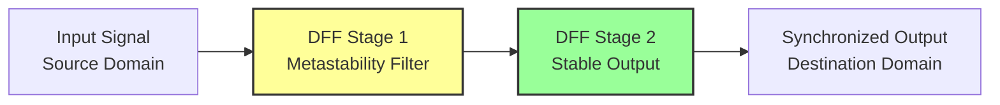
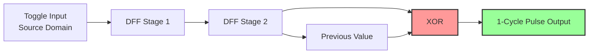
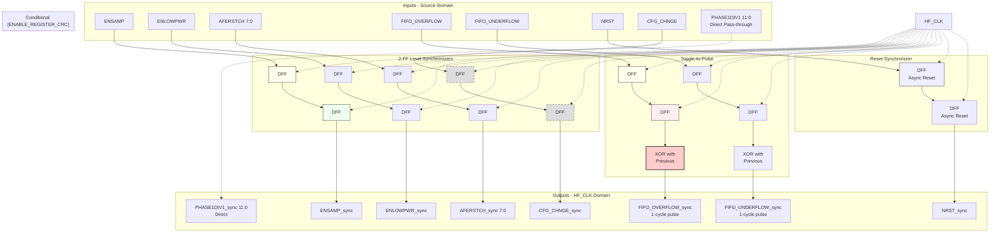

# CDC_sync Module Documentation

## Overview

The `CDC_sync` module provides **Clock Domain Crossing (CDC) synchronization** for signals crossing from the SPI clock domain (or other source domains) into the high-frequency clock domain (`HF_CLK`). It implements multiple synchronization strategies tailored to different signal types and timing requirements.

**File Location:** [CDC_sync.v](file:///c:/Users/ian_l/Dropbox%20%28UK%20Dementia%20Research%20Institute%29/Box%20Sync/MINT/Design/Verilog/Pepper_T4/code/source/CDC_sync.v)

---

## Synchronization Mechanisms

### 1. Standard 2-Flip-Flop Synchronizer (Level Synchronization)

Most control signals use a **2-stage flip-flop synchronizer** chain, which is the industry-standard approach for synchronizing level signals across clock domains.

**Signals using this mechanism:**
- `ENSAMP` → `ENSAMP_sync`
- `ENLOWPWR` → `ENLOWPWR_sync`
- `ENMONTSENSE` → `ENMONTSENSE_sync`
- `ADCOVERFLOW` → `ADCOVERFLOW_sync`
- `ADCOVERFLOW` → `ADCOVERFLOW_sync`
- `CFG_CHNGE` → `CFG_CHNGE_sync` *(Conditional: enabled via `ENABLE_REGISTER_CRC`)*
- `AFERSTCH[7:0]` → `AFERSTCH_sync[7:0]`
- `AFERSTCH[7:0]` → `AFERSTCH_sync[7:0]`
- `SATDETECT[7:0]` → `SATDETECT_sync[7:0]`

**How it works:**


The first flip-flop may enter a metastable state, but the second flip-flop resolves this to a stable logic level before the signal is used. This provides reliable level synchronization with 2 clock cycles of latency.

### 2. Toggle-to-Pulse Converter

The FIFO overflow and underflow signals use a special **toggle synchronization** approach followed by edge detection to generate single-cycle pulses in the destination domain.

**Signals using this mechanism:**
- `FIFO_OVERFLOW` → `FIFO_OVERFLOW_sync`
- `FIFO_UNDERFLOW` → `FIFO_UNDERFLOW_sync`

**How it works:**

The source domain toggles the signal for each event. The destination domain:
1. Synchronizes the toggling signal through a 2-FF chain
2. Compares current value with previous value (XOR operation)
3. Generates a **1-cycle pulse** on each detected edge



This approach allows events in a slow source domain to be reliably captured in a fast destination domain, even if multiple events occur between destination clock edges.

### 3. Asynchronous Assert, Synchronous Deassert (Reset)

The reset signal `NRST` uses a special CDC technique appropriate for reset signals:
- **Asynchronous assertion**: When `NRST` goes low, the synchronized reset immediately goes low
- **Synchronous deassertion**: When `NRST` goes high, it's synchronized through 2 FFs before releasing reset

This ensures reset is applied immediately but released cleanly without metastability.

### 4. Direct Pass-Through (Area Optimization)

Some configuration buses are **not synchronized** and passed directly through:
- `PHASE1DIV1[11:0]`
- `PHASE1COUNT[3:0]`
- `PHASE2COUNT[9:0]`
- `CHEN[7:0]`
- `ADCOSR[3:0]`

> [!CAUTION]
> **Multi-bit CDC Hazard!**
> 
> These signals are passed through without synchronization to save area. The system **MUST** ensure these configuration registers are only modified when `ENSAMP` is low (sampling disabled). Changing multi-bit values during operation can cause incorrect intermediate values to be sampled due to skew between bits.

---

## Timing Constraints

### Input Pulse Width Requirements

> [!WARNING]
> **Critical Timing Constraint for Toggle Synchronization**
> 
> For the `FIFO_OVERFLOW` and `FIFO_UNDERFLOW` toggle-based synchronizers to guarantee event capture, the input signal must maintain each toggle state for a minimum duration to ensure it is sampled by the destination clock.
> 
> **Minimum Pulse Width Rule:**
> ```
> T_input_stable ≥ T_dest_clk + T_setup + T_meta
> ```
> 
> Where:
> - `T_input_stable` = Duration the input toggle state must remain stable
> - `T_dest_clk` = Destination clock period (HF_CLK)
> - `T_setup` = Setup time of the destination flip-flops
> - `T_meta` = Metastability resolution time allowance
> 
> **Practical Rule:** The input should remain stable for **at least 1.5× to 2× the destination clock period** to guarantee reliable capture.
> 
> **Example:** If `HF_CLK` = 1 MHz (1 us period), the FIFO overflow/underflow toggle should remain in each state for **≥ 1.5-2 us** minimum.

### Level Synchronizer Constraints

For the standard 2-FF synchronizers (`ENSAMP`, `ENLOWPWR`, etc.):

**Input Stability Requirement:**
- Level signals should be **quasi-static** (change infrequently relative to destination clock)
- Signal must remain stable for at least one full destination clock cycle to guarantee capture
- Faster changes may be captured with variable latency (2-3 destination clock cycles)

> [!IMPORTANT]
> Multi-bit buses like `AFERSTCH[7:0]` and `SATDETECT[7:0]` are synchronized bit-independently. To avoid capturing intermediate values during transitions:
> - Keep these buses stable for multiple destination clock cycles when changing
> - Use gray-code encoding if values must change rapidly
> - OR ensure the source domain changes bits simultaneously (same clock edge)

---

## Block Diagram

