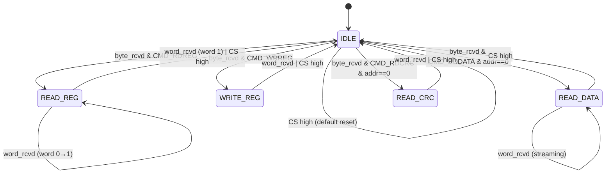

# Command Interpreter

## Overview
The **Command Interpreter** is the control center of the Pepper T4 digital logic. It acts as an SPI slave, decoding host commands and orchestrating data flow between:
*   **Configuration Registers** (write/read configuration)
*   **FIFO** (streaming ADC data to host)
*   **Status Monitor** (reporting system health)
*   **Temperature Buffer** (reading temperature sensor)

The module operates entirely in the **SCK domain** (SPI clock), with careful synchronization of inputs from the **HF_CLK domain** (Status, ENSAMP, TEMPVAL).

## SPI Protocol

### Mode & Timing
*   **SPI Mode**: Mode 0 (CPOL=0, CPHA=0)
    *   Clock idle state is LOW
    *   Data is captured on the rising edge of SCK
    *   Data is shifted out on the falling edge of SCK
*   **Bit Order**: MSB first
*   **Word Size**: 16 bits (8-bit command + 8-bit data)

### Command Structure
Each SPI transaction begins with an 8-bit **command byte**:

| Bits | Field | Description |
|:---:|:---|:---|
| `[7:6]` | **Opcode** | `00`=Read Register, `01`=Read CRC, `10`=Write Register, `11`=Read Data |
| `[5:0]` | **Address** | Register address or stream identifier |

### Response Format
The module prepends a **Status Word** to every response:

```
[15:14] = 01 (Status response identifier)
[13:0]  = 14-bit Status register snapshot
```

## Finite State Machine

The Command Interpreter uses a **one-hot encoded** 5-state FSM:



### State Descriptions

| State | Function | Exit Condition |
|:---|:---|:---|
| **IDLE** | Waiting for command byte. Returns Status word on `tx_buff`. | Command opcode decoded |
| **READ_REG** | Two-word sequence: ①Status ②Register data | After 2nd word or CS high |
| **WRITE_REG** | Write data byte to target register (if allowed) | After word received or CS high |
| **READ_DATA** | Streaming FIFO readout (8×16-bit words per frame) | CS high (manual stop) |
| **READ_CRC** | Return CRC-16-CCITT checksum of last FIFO burst | After word or CS high |

## Multi-Word Transaction Handling

### Word vs. Byte Structure
The SPI interface operates on **16-bit words** composed of two sequential 8-bit bytes:
*   **Byte 0**: Command or high byte
*   **Byte 1**: Data or low byte

The `spiCore` module provides two pulse signals to the Command Interpreter:
*   **`byte_rcvd`**: Pulses after each 8-bit byte
*   **`word_rcvd`**: Pulses after every 2nd byte (16 bits complete)

### Single-Word Transactions
Most commands complete in a single word (16 SCK cycles):

1.  **Byte 0 received** → `byte_rcvd` pulses
    *   Command Interpreter captures opcode and address
    *   FSM transitions from `IDLE` to target state
2.  **Byte 1 received** → `word_rcvd` pulses
    *   For `WRITE_REG`: Data is written to register
    *   For `READ_CRC`: CRC value is transmitted
    *   FSM returns to `IDLE`

### Multi-Word Transactions

#### READ_REG (2-Word Sequence)
The `READ_REG` state uses a counter (`read_reg_word_count`) to track progress:

| Word | Counter | MISO Response | Action |
|:---:|:---:|:---|:---|
| **0** | `0` | Status[13:0] + `01` | Command parsed; counter resets to 0 |
| **1** | `1` | `0xC0` + Register[7:0] | Register data transmitted; return to IDLE |

**Implementation:** The counter increments on each `word_rcvd` while in `READ_REG` state (line 254-256).

#### READ_DATA (Streaming Mode)
For FIFO readout, the transaction continues until the host raises **CS**:

1.  **Word 0**: First 16-bit ADC sample (`ADC_data[15:0]`)
2.  **Word 1**: Second sample (`ADC_data[31:16]`)
3.  **...continues...**
4.  **Word 7**: Eighth sample (`ADC_data[127:112]`)
5.  **Auto-Pop**: After word 7, `FIFO_POP` pulses and a new frame is loaded
6.  **Word 8+**: Streaming continues from the next frame

**Word Selection Logic** (line 461):
```verilog
tx_buff_reg = ADC_data[word_counter*16 +: 16];
```

The `word_counter` (3-bit, 0-7) increments on each `word_rcvd` and wraps around, triggering a FIFO pop on the transition from 7→0.

### Transaction Boundary Reset
**Critical:** The `first_transaction` flag (lines 168-174) detects the very first byte after CS assertion. This prevents stale commands from the previous transaction from executing if CS glitches or bounces.

```verilog
always @(posedge SCK or posedge CS) begin
    if (CS) begin
        first_transaction <= 1'b1;
    end else if (byte_rcvd) begin
        first_transaction <= 1'b0;
    end
end
```

If `first_transaction` is high during state execution, the FSM immediately aborts to `IDLE`.

## Write Protection & Permissions

### Safe vs. Restricted Registers
To prevent glitches in the analog domain, **most configuration registers are write-protected when sampling is active** (`ENSAMP=1`).

**Always writable** (exceptions):
*   `0x12` (`AFERSTCH`): Channel reset control
*   `0x13`: AFE monitor enables
*   `0x23`: Contains `ENSAMP` bit itself (allows stopping sampling)

**Protected when `ENSAMP=1`**:
*   All other configuration registers (`0x00–0x22`)

**Always writable** (special addresses):
*   `0x26` (`STATUS_CLR_LO`): Write-1-to-Clear for saturation flags
*   `0x27` (`STATUS_CLR_HI`): Write-1-to-Clear for upper status bits

### Implementation Detail
The write-enable logic (lines 273-286):
```verilog
if (reg_addr_reg <= 6'h23) begin
    if (!ENSAMP_sync_reg[1] ||
        (reg_addr_reg == REG_23_SAFE) ||
        (reg_addr_reg == REG_AFERSTCH) ||
        (reg_addr_reg == REG_13_SAFE)) begin
        reg_value_reg <= data_byte;
        wr_en_reg <= 1'b1;
    end else begin
        wr_en_reg <= 1'b0;  // Silently ignore
    end
end
```

## Clock Domain Crossing (CDC)

The Command Interpreter receives three signals from the **HF_CLK domain**:
1.  **Status[13:0]**: System health flags
2.  **ENSAMP_sync**: Sampling active indicator
3.  **TEMPVAL[15:0]**: Temperature sensor readout

Each is synchronized using **2-stage flip-flop chains** (lines 137-151):
```verilog
always @(posedge SCK or negedge NRST) begin
    status_sync[0] <= status;
    status_sync[1] <= status_sync[0];  // Use stage [1] for logic
    // ... similar for TEMPVAL and ENSAMP
end
```

This ensures meta-stability is resolved before use in the SCK domain logic.

## Status Clear (W1C) Mechanism

The Command Interpreter implements a **Write-1-to-Clear** queue with handshake to the HF_CLK domain:

1.  **Queue Phase** (SCK domain): Writes to `0x26`/`0x27` set bits in `status_clr_queued_*`.
2.  **Launch Phase**: When not in-flight, the queued mask is copied to `status_clr_inflight_*` and a **toggle request** is sent.
3.  **Handshake**: The `Status_Clear_CDC` bridge detects the toggle, pulses the clear in HF_CLK, and toggles back an **ack**.
4.  **Consume Phase**: The ack toggle is synchronized back to SCK, clearing the in-flight flag.

This allows overlapping clear requests without data loss.

## Example Transaction: Write Register

```wavedrom
{
  "signal": [
    {"name": "CS", "wave": "10..........1"},
    {"name": "SCK", "wave": "0.p.........|", "period": 0.5},
    {"name": "MOSI", "wave": "x.===x......", "data": ["CMD", "ADDR", "DATA"]},
    {"name": "MISO", "wave": "x....===x...", "data": ["STAT_HI", "STAT_LO", "ACK"]},
    {},
    {"name": "byte_rcvd", "wave": "0..1.0.1.0.."},
    {"name": "word_rcvd", "wave": "0......1.0.."},
    {"name": "state", "wave": "2..3....2...", "data": ["IDLE", "WRITE_REG", "IDLE"]},
    {"name": "wr_en", "wave": "0.......1.0."}
  ],
  "config": {"hscale": 1.5}
}
```

**Sequence:**
1.  **Byte 0** (Command): `10XXXXXX` (WRREG opcode) triggers transition to `WRITE_REG`.
2.  **Byte 1** (Data): Written to target register on `word_rcvd`.
3.  **Response**: Status word is returned on MISO during the transaction.
4.  **Completion**: `wr_en` pulses for one SCK cycle; state returns to `IDLE` on CS high.

## Register Address Map (Read Access)

| Address | Name | Description |
|:---:|:---|:---|
| `0x00–0x23` | Configuration Registers | Physical config registers (see Register Map doc) |
| `0x24` | `STATUS_LO` | Status bits [7:0] (Saturation flags) |
| `0x25` | `STATUS_HI` | Status bits [13:8] packed into [5:0] |
| `0x2C` | `TEMPVAL_HI` | Temperature sensor high byte |
| `0x2D` | `TEMPVAL_LO` | Temperature sensor low byte |

## Key Design Choices

1.  **One-Hot FSM**: Simplifies decode logic and improves timing in ASIC.
2.  **Always-Valid `tx_buff`**: The transmit buffer is combinationally generated, ensuring data is ready before the SPI core shifts it out.
3.  **First Transaction Detection**: Uses an asynchronous set flip-flop (line 168) to detect the very first byte after CS assertion, preventing stale commands from executing.
4.  **Modular CRC**: The CRC-16-CCITT calculation is self-contained (lines 375-411) and can be easily removed if area is critical.
