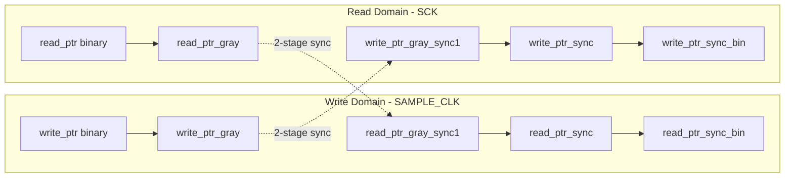

# FIFO

## Overview
The Pepper T4 FIFO is a **frame-based asynchronous FIFO** that buffers multi-channel ADC data between the sampling domain (`SAMPLE_CLK`) and the SPI readout domain (`SCK`). Unlike a conventional word-level FIFO, each entry is a **128-bit frame** containing 8 × 16-bit ADC samples (one per channel).

## Architecture

### Clock Domains
*   **Write Domain** (`SAMPLE_CLK`): ADC results are written word-by-word using one-hot `ATMCHSEL`, then the frame pointer advances on `LASTWORD`.
*   **Read Domain** (`SCK`): The Command Interpreter issues `FIFO_POP` to read complete 128-bit frames.

### Memory Structure
```
Parameter: FRAME_DEPTH (default 4, must be power of 2)

Each frame slot:
┌──────────┬──────────┬──────────┬───┬──────────┐
│ CH0[15:0]│ CH1[15:0]│ CH2[15:0]│...│ CH7[15:0]│
└──────────┴──────────┴──────────┴───┴──────────┘
  bits 15:0   31:16      47:32          127:112
```

### Gray Code Pointer Synchronization



Pointers use an **extra MSB** beyond the address width. This allows distinguishing "full" (pointers differ only in MSB) from "empty" (pointers equal). Gray coding ensures only one bit changes per increment, preventing meta-stability glitches during CDC.

**Conversion functions** (lines 62-78):
```verilog
bin_to_gray = bin ^ (bin >> 1);
// Gray-to-binary: XOR cascade from MSB down
```

## Write Behavior (SAMPLE_CLK Domain)

### Word-Level Writes
ADC results are written to specific 16-bit slots within the current frame using the one-hot `ATMCHSEL` signal:

```verilog
case (1'b1)
    ATMCHSEL[0]: mem[write_ptr][15:0]    <= RESULT;
    ATMCHSEL[1]: mem[write_ptr][31:16]   <= RESULT;
    // ... up to ATMCHSEL[7]
endcase
```

This allows **sparse writes**: only enabled channels update their slots. Disabled channels read as zero because the frame is pre-cleared.

### Frame Advance
On `LASTWORD`, the write pointer advances and the **next** frame slot is pre-cleared to zero:

```verilog
if (LASTWORD) begin
    mem[write_ptr_next] <= 128'h0;  // Pre-clear next slot
    write_ptr <= write_ptr + 1;
    write_ptr_gray <= bin_to_gray(write_ptr + 1);
end
```

### Frame Cleanup After Read
When a `frame_pop_edge` is detected (synchronized from SCK domain), the write domain zeros out the previously-read frame slot to prevent stale data leakage:

```verilog
if (frame_pop_edge)
    mem[read_ptr_sync_prev_idx] <= 128'h0;
```

## Read Behavior (SCK Domain)

### Look-Ahead Read Interface
The FIFO implements **Look-Ahead Read** behavior. The data at `read_ptr` is continuously driven to `ADC_data` whenever frames are available.

*   **Before POP**: `ADC_data` contains the *current* valid frame (or zero if empty).
*   **FIFO_POP Pulse**: Advances the read pointer to the *next* frame.
*   **Latency**: Data is valid immediately upon `DATA_RDY` assertion (subject to synchronization latency).

!!! success "Integration Simplified"
    Unlike previous versions, there is **no dummy pop required**. The first frame of data is valid and present on `ADC_data` as soon as the FIFO is not empty.

### Read Logic (lines 240-270)
```verilog
// Look-ahead: Output valid data if available
if (frames_available)
    ADC_data <= mem[read_ptr[ADDR_WIDTH-1:0]];
else
    ADC_data <= 128'h0;

// POP only advances the pointer
if (FIFO_POP && frames_available) begin
    read_ptr      <= read_ptr + 1'b1;
    read_ptr_gray <= bin_to_gray(read_ptr + 1'b1);
end
```

### Multi-Frame Streaming Timing

```wavedrom
{
  "signal": [
    {"name": "SCK",          "wave": "p..................."},
    {"name": "DATA_RDY",     "wave": "01.................."},
    {"name": "FIFO_POP",     "wave": "0......10.......10.."},
    {"name": "ADC_data",     "wave": "23333334444444455...", "data": ["0", "Frame N", "Frame N+1", "Frame N+2"]},
    {"name": "read_ptr",     "wave": "22222223333333344...", "data": ["N", "N+1", "N+2"]}
  ],
  "config": {"hscale": 1.0}
}
```

1.  **Frame N Ready**: `ADC_data` updates to Frame N.
2.  **Host Reads**: Host shifts out 128 bits (8 words).
3.  **POP**: Host issues `FIFO_POP` (via `Command_Interpreter`).
4.  **Advance**: FIFO updates `read_ptr` -> `ADC_data` changes to Frame N+1.

## Flags & Status

### DATA_RDY (Watermark)
```verilog
DATA_RDY = (frame_count >= FIFOWATERMARK) && ENSAMP_sync;
```
*   Asserted when the number of buffered frames meets or exceeds the configured watermark threshold.
*   **Gated by `ENSAMP_sync`**: DATA_RDY is forced low when sampling is disabled.

### Frame Count
```verilog
frame_count = write_ptr - read_ptr_sync_bin;
```
Computed in the write domain using the synchronized read pointer. This is a conservative estimate (may lag by up to 2 SAMPLE_CLK cycles due to synchronization latency).

### Overflow
| Condition | `frame_count == FRAME_DEPTH` when `LASTWORD` asserts |
|:---|:---|
| **Mechanism** | Toggle `fifo_overflow_evt_tgl` |
| **Meaning** | A new frame was committed but the FIFO was already full; the oldest unread frame is silently overwritten |

### Underflow
| Condition | `FIFO_POP` asserted when `!frames_available` while `ENSAMP_sync` is high |
|:---|:---|
| **Mechanism** | Toggle `fifo_underflow_evt_tgl` |
| **Meaning** | Host attempted to read but no data was available; `ADC_data` returns zeros |

!!! note "Toggle-Based Event Signaling"
    Overflow and underflow are signaled as **toggle events**, not level flags. The `CDC_sync` module detects edges on these toggles to generate single-cycle pulses in the `HF_CLK` domain for the Status Monitor. This avoids the need for handshake protocols and is robust to clock ratio variations.

## Reset & Disable Behavior

### Global Reset (`NRST_sync`)
Clears all pointers, memory, and event toggles in both domains.

### Sampling Disable (`ENSAMP_sync` → low)

**Write domain** (synchronous to `SAMPLE_CLK`):
*   Write pointer reset to zero
*   All memory cleared

**Read domain** (asynchronous assert, synchronous deassert to `SCK`):
*   Uses a dedicated reset synchronizer (`ensamp_rst_ff`) to safely bring the read domain to a clean state:
    ```verilog
    // Assert async on ENSAMP_sync low; release sync after 2 SCK cycles
    always @(posedge SCK or negedge NRST_sync or negedge ENSAMP_sync) begin
        if (!NRST_sync || !ENSAMP_sync)
            ensamp_rst_ff <= 2'b00;
        else
            ensamp_rst_ff <= {ensamp_rst_ff[0], 1'b1};
    end
    assign ensamp_rstn_sck = ensamp_rst_ff[1];
    ```
*   Read pointer and `ADC_data` cleared to zero
*   Underflow toggle is **preserved** (not reset) to avoid false CDC edges

!!! warning "Procedural Constraint"
    After disabling sampling (`ENSAMP=0`), the MCU must end the current SPI transaction before issuing any RDDATA commands. FIFO reads while disabled return undefined/zero data.

## Timing Reference

```wavedrom
{
  "signal": [
    {"name": "SAMPLE_CLK", "wave": "p............"},
    {"name": "DONE",       "wave": "010101010...."},
    {"name": "ATMCHSEL",   "wave": "x3x4x5x6x...", "data": ["CH0","CH1","CH2","CH3"]},
    {"name": "LASTWORD",   "wave": "0......10...."},
    {"name": "write_ptr",  "wave": "2......2.....", "data": ["N", "N+1"]},
    {},
    {"name": "SCK",         "wave": "p............"},
    {"name": "DATA_RDY",    "wave": "0.......1...."},
    {"name": "FIFO_POP",    "wave": "0........10.."},
    {"name": "ADC_data",    "wave": "x........2...", "data": ["Frame N"]},
    {"name": "read_ptr",    "wave": "2........2...", "data": ["N", "N+1"]}
  ],
  "config": {"hscale": 1.2}
}
```
