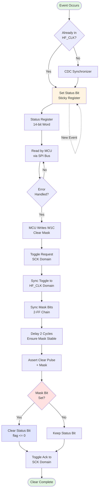

# Status Generation and Clearing Logic

## Overview

The status monitoring system in the Pepper T4 design tracks various error and state conditions across multiple clock domains. Status bits are generated in the high-frequency clock domain (`HF_CLK`) and can be cleared via commands from the SPI clock domain (`SCK`). This document describes the lifecycle of status bits, the clearing mechanism, and the gating behavior.

---

## The Cycle of a Status Bit

This section describes the process that occurs for each status bit from event detection through synchronization to final registration:

### 1. Event Detection (Source Domain)

Status events originate from various sources in the design:
- **FIFO Overflow/Underflow**: Pulses from the FIFO module (already synchronized to `HF_CLK`)
- **ADC Overflow**: Pulse from the ADC indicating overflow condition
- **Saturation Detection**: 8-bit vector indicating which channels detected saturation
- **Analog Frontend Reset**: 8-bit vector indicating AFE reset events
- **Configuration Change**: Detected by comparing current `CRCCFG` with previous value

### 2. Synchronization to HF_CLK

Most status sources are already synchronized to `HF_CLK` before reaching the `Status_Monitor` module:
- `FIFO_OVERFLOW_sync` and `FIFO_UNDERFLOW_sync` are pre-synchronized
- `AFERSTCH_sync` and `SATDETECT_sync` are pre-synchronized
- `ADCOVERFLOW` is generated in the `HF_CLK` domain
- `CRCCFG` change detection happens directly in `HF_CLK` domain

### 3. Sticky Bits (Memory Behavior)

The `Status_Monitor` module implements **sticky** status bits using synchronous registers:

```verilog
// Example: FIFO Overflow status bit
if (FIFO_OVERFLOW_sync) begin
    fifo_ovf_flag <= 1'b1;  // Set on event
end
```

Key characteristics:
- **Synchronous Set**: Status bits are set on the rising edge of `HF_CLK` when the event signal is high
- **Sticky**: Once set, the bit remains high until explicitly cleared by software
- **Priority**: If an event occurs in the same cycle as a clear command, the set operation takes priority (event is not lost)

### 4. Registration and Output

All status bits are registered in the `HF_CLK` domain and assembled into a 14-bit status word:

| Bit | Name | Description |
|-----|------|-------------|
| 13 | ENSAMP | Enable Sampling state (not sticky) |
| 12 | CFGCHNG | Configuration changed |
| 11 | ANALOG_RESET | Analog frontend reset detected |
| 10 | FIFO_UDF | FIFO underflow |
| 9 | FIFO_OVF | FIFO overflow |
| 8 | ADC_OVF | ADC overflow |
| 7:0 | SAT[7:0] | Saturation detection per channel |

---

## Clearing Mechanism

### Write-1-to-Clear (W1C) Protocol

Status bits use the **W1C** (Write-1-to-Clear) protocol:
- Software writes a `1` to a status bit position to clear it
- Writing `0` has no effect (preserves current state)
- Multiple bits can be cleared simultaneously by writing a mask with multiple `1`s

### Cross-Domain Clear Propagation

Since status bits live in the `HF_CLK` domain but are cleared from the `SCK` domain, the `Status_Clear_CDC` module handles the clock domain crossing:

#### Step 1: Toggle Request (SCK Domain)
The command interpreter in the `SCK` domain initiates a clear by:
1. Setting up the clear mask (`status_clr_lo_sck[7:0]` and `status_clr_hi_sck[5:0]`)
2. Toggling the request signal (`status_clr_req_tgl_sck`)
3. Waiting for acknowledgment toggle

#### Step 2: Synchronization (CDC Module)
The `Status_Clear_CDC` module:
1. **Synchronizes the toggle request** using a 2-FF synchronizer chain
2. **Synchronizes the mask bits** using separate 2-FF chains (mask is held stable during the handshake)
3. **Detects the toggle edge** by comparing current and previous synchronized toggle values
4. **Delays the clear pulse** by 2 `HF_CLK` cycles to ensure mask bits are fully synchronized and stable

```verilog
// Edge detection
assign req_edge = (req_ff[1] ^ req_prev);

// Delayed pulse generation
if (req_edge) begin
    pending <= 1'b1;
    pending_cnt <= 2'b00;
end else if (pending) begin
    pending_cnt <= pending_cnt + 1'b1;
    if (pending_cnt == 2'b10) begin
        pulse_reg <= 1'b1;           // Fire clear pulse
        ack_tgl_reg <= ~ack_tgl_reg; // Toggle acknowledgment
        pending <= 1'b0;
    end
end
```

#### Step 3: Clear Execution (Status Monitor)
When `status_clr_pulse` is asserted, the `Status_Monitor` clears bits according to the mask:

```verilog
if (status_clr_pulse) begin
    if (status_clr_mask[12]) cfgchng_flag <= 1'b0;
    if (status_clr_mask[11]) analog_reset_flag <= 1'b0;
    if (status_clr_mask[10]) fifo_udf_flag <= 1'b0;
    if (status_clr_mask[9])  fifo_ovf_flag <= 1'b0;
    if (status_clr_mask[8])  adc_ovf_flag <= 1'b0;
    for (i = 0; i < 8; i = i + 1) begin
        if (status_clr_mask[i]) sat_flags[i] <= 1'b0;
    end
end
```

#### Step 4: Acknowledgment (Back to SCK Domain)
The acknowledgment toggle (`status_clr_ack_tgl_hf`) is synchronized back to the `SCK` domain, allowing the command interpreter to proceed with the next operation.

---

## Gating with ENSAMP

### ENSAMP Behavior

The `ENSAMP` (Enable Sampling) signal has **unique characteristics** compared to other status bits:

1. **Not Sticky**: `ENSAMP` directly reflects the synchronized state of the sampling enable signal
   ```verilog
   ensamp_flag <= ENSAMP_sync;  // Updated every cycle
   ```

2. **Not Clearable**: The `ENSAMP` bit (bit 13) is **not** included in the clearable status bits. It cannot be cleared via W1C.

3. **State Indicator**: It serves as a real-time indicator of whether sampling is currently enabled, not as an error flag.

### Effect on Status Generation

**Important**: `ENSAMP` does **NOT** gate the generation of other status bits in the `Status_Monitor` module.

- Status events (FIFO overflow, ADC overflow, saturation, etc.) can be **set even when sampling is disabled** (`ENSAMP_sync = 0`)
- This design choice ensures that error conditions are always captured, regardless of sampling state
- The gating of actual data sampling happens elsewhere in the design (e.g., in the ADC interface or FIFO write logic)

This behavior is intentional and allows the system to detect and report error conditions that may occur during startup, shutdown, or configuration changes when sampling is temporarily disabled.

---

## Status Lifecycle Diagram

The following Mermaid flowchart visualizes the complete loop from event detection through clearing:



### Diagram Legend

- **Green**: Start/End points
- **Yellow**: Latching/Storage operations
- **Red**: Decision points
- **Blue**: Clear operations
- **Dashed line**: Concurrent event handling (new events can occur while status is latched)

---

## Key Design Considerations

### 1. Metastability Protection
- All clock domain crossings use proper 2-FF synchronizer chains
- Toggle-based handshaking ensures reliable cross-domain communication
- Mask bits are held stable during the handshake to prevent metastability

### 2. Race Condition Handling
- Clear logic executes **before** set logic in the same `always` block
- If an event occurs in the same cycle as a clear, the set takes priority
- This ensures no events are lost during clearing

### 3. Timing Constraints
- The 2-cycle delay in `Status_Clear_CDC` ensures synchronized mask bits are stable before use
- Toggle-based handshaking is frequency-independent (works across arbitrary clock ratios)

### 4. Software Considerations
- Software must read status, handle the condition, then write W1C to clear
- Multiple status bits can be cleared in a single write operation
- `ENSAMP` bit cannot be cleared (it's a state indicator, not an error flag)

---

## Related Modules

- [`Status_Monitor.v`](file:///c:/Users/ian_l/Dropbox%20(UK%20Dementia%20Research%20Institute)/Box%20Sync/MINT/Design/Verilog/Pepper_T4/code/source/Status_Monitor.v) - Main status bit registration and assembly
- [`Status_Clear_CDC.v`](file:///c:/Users/ian_l/Dropbox%20(UK%20Dementia%20Research%20Institute)/Box%20Sync/MINT/Design/Verilog/Pepper_T4/code/source/Status_Clear_CDC.v) - Clock domain crossing for clear commands
- `Command_Interpreter.v` - Initiates clear requests from SPI domain
